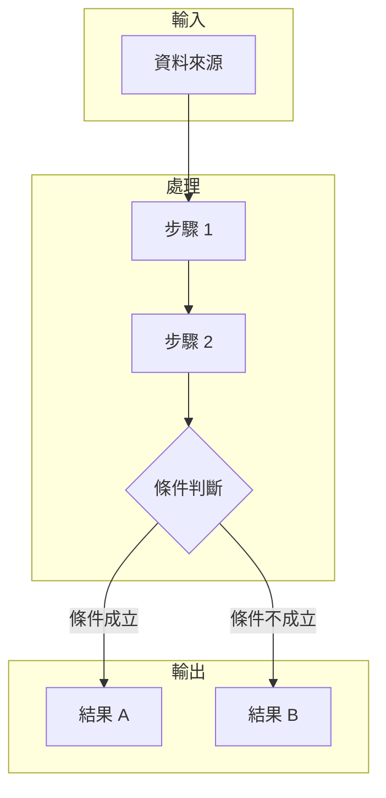

# [Workflow 名稱]

## 概述

簡述此流程的目的和使用時機。

## 流程圖

```mermaid
flowchart TD
    subgraph Input["輸入"]
        A["資料來源"]
    end

    subgraph Process["處理"]
        B["步驟 1"]
        C["步驟 2"]
        D{"條件判斷"}
    end

    subgraph Output["輸出"]
        E["結果 A"]
        F["結果 B"]
    end

    A --> B
    B --> C
    C --> D
    D -->|條件成立| E
    D -->|條件不成立| F
```

## 步驟說明

### 1. [步驟名稱]

- 說明這個步驟做什麼
- 輸入：
- 輸出：

### 2. [步驟名稱]

- 說明這個步驟做什麼
- 輸入：
- 輸出：

## 相關文件

- 相關 ADR
- 程式碼位置
