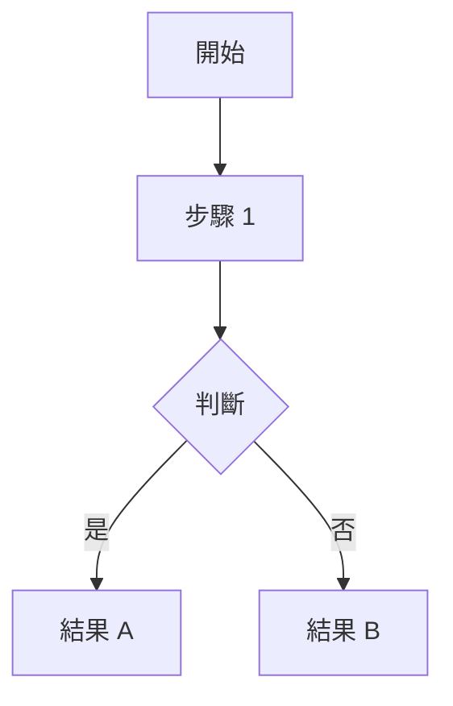

# Workflows 流程圖

本目錄存放專案關鍵流程的 Mermaid 視覺化圖表。

---

## Workflow 索引

| 檔案名稱 | 說明 | 最後更新 |
|----------|------|----------|
| *尚無流程圖* | - | - |

---

## 建立指南

### 推薦格式

**優先使用 `flowchart TD`**（Top-Down），這是最穩定且可讀的格式：

### 最佳實踐

1. **節點文字用引號包裹**：`A["節點文字"]`
2. **避免複雜 subgraph**：盡量使用簡單的兩層結構
3. **使用有意義的節點 ID**：`setup`, `train`, `eval` 而非 `A`, `B`, `C`

### 命名規則

- 格式：`kebab-case-name.md`
- 範例：`mjx-training-pipeline.md`

---

## 模板位置

`.claude/templates/workflow-template.md`
